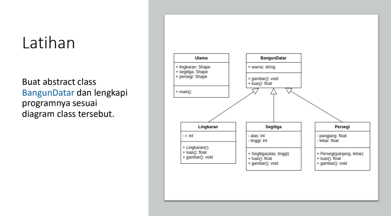
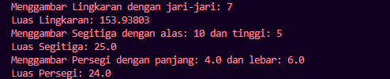

|Nama|NIM|Kelas|Mata Kuliah|
|----|---|-----|------|
|**Radityatama Nugraha**|**312310644**|**TI.23.A6**|**Pemrograman Orientasi Objek**|



# • Buat abstract class BangunDatar dan lengkapi programnya sesuai diagram class tersebut

## • Abstract Class BangunDatar
```java
abstract class BangunDatar {
    String warna;

    public abstract void gambar();
    public abstract float luas();
}
```
### Penjelasan :
```
- BangunDatar adalah class abstrak yang berfungsi sebagai kerangka dasar untuk class turunan.
- Atribut:
  - warna: Sebagai atribut umum untuk semua bangun datar (tidak digunakan dalam perhitungan, tetapi bisa diimplementasikan untuk tampilan).
- Metode abstrak:
  - gambar(): Harus diimplementasikan oleh subclass untuk mencetak cara menggambar.
  - luas(): Harus diimplementasikan oleh subclass untuk menghitung luas bangun datar.
```

## • Class Lingkaran
```java
class Lingkaran extends BangunDatar {
    private int r; 

    public Lingkaran(int r) {
        this.r = r;
    }

    @Override
    public void gambar() {
        System.out.println("Menggambar Lingkaran dengan jari-jari: " + r);
    }

    @Override
    public float luas() {
        return (float) (Math.PI * r * r);
    }
}
```
### Penjelasan :
```
- Atribut: r (int) menyimpan nilai jari-jari lingkaran.
- Konstruktor:
  - Menerima nilai jari-jari r dan menyimpannya di atribut.
- Metode:
  - gambar(): Menampilkan pesan tentang lingkaran yang digambar.
  - luas(): Menghitung luas lingkaran menggunakan rumus:
                                      Luas = 𝜋 ⋅ 𝑟 2
```

## • Class Segitiga
```java
class Segitiga extends BangunDatar {
    private int alas, tinggi; 

    public Segitiga(int alas, int tinggi) {
        this.alas = alas;
        this.tinggi = tinggi;
    }

    @Override
    public void gambar() {
        System.out.println("Menggambar Segitiga dengan alas: " + alas + " dan tinggi: " + tinggi);
    }

    @Override
    public float luas() {
        return 0.5f * alas * tinggi;
    }
}
```
### Penjelasan :
```
- Atribut:
  - alas (int) dan tinggi (int) untuk menyimpan nilai dimensi segitiga.
- Konstruktor:
  - Menerima nilai alas dan tinggi, lalu menyimpannya dalam atribut.
- Metode:
  - gambar(): Menampilkan pesan tentang segitiga yang digambar.
  - luas(): Menghitung luas segitiga menggunakan rumus:
                        Luas = 1 per 2 ⋅ alas ⋅ tinggi
```

## • Class Persegi
```java
class Persegi extends BangunDatar {
    private float panjang, lebar; 

    public Persegi(float panjang, float lebar) {
        this.panjang = panjang;
        this.lebar = lebar;
    }

    @Override
    public void gambar() {
        System.out.println("Menggambar Persegi dengan panjang: " + panjang + " dan lebar: " + lebar);
    }

    @Override
    public float luas() {
        return panjang * lebar;
    }
}
```
### Penjelasan :
```
- Atribut:
  - panjang (float) dan lebar (float) untuk menyimpan dimensi persegi panjang.
- Konstruktor:
  - Menerima nilai panjang dan lebar, lalu menyimpannya di atribut.
- Metode:
  - gambar(): Menampilkan pesan tentang persegi panjang yang digambar.
  - luas(): Menghitung luas persegi panjang menggunakan rumus:
                                  Luas = panjang ⋅ lebar
```

## • Main Class Utama
```java
public class Utama {
    public static void main(String[] args) {
        BangunDatar lingkaran = new Lingkaran(7);
        BangunDatar segitiga = new Segitiga(10, 5);
        BangunDatar persegi = new Persegi(4, 6);

        lingkaran.gambar();
        System.out.println("Luas Lingkaran: " + lingkaran.luas());

        segitiga.gambar();
        System.out.println("Luas Segitiga: " + segitiga.luas());

        persegi.gambar();
        System.out.println("Luas Persegi: " + persegi.luas());
    }
}
```
### Penjelasan :
```
- Fungsi Utama:
  - Membuat objek dari Lingkaran, Segitiga, dan Persegi dengan nilai dimensi yang diberikan.
  - Menggunakan polimorfisme (BangunDatar sebagai tipe referensi untuk objek turunan).
  - Memanggil metode gambar dan luas dari masing-masing objek.
```

# Output :

